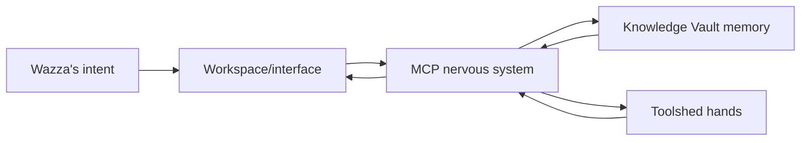

# Ariadne's four architectural parcels

Status: active project vocabulary
Defined: 2026-08-15

Ariadne is developed as four cooperating parcels. Each parcel has a distinct
responsibility and can be improved without making the reasoning model itself
the owner of identity, memory, tools, or continuity.

## 1. Knowledge Vault — memory

The Knowledge Vault is Ariadne's durable memory and evidence store.

Current implementation:

- Private Markdown knowledge folders at the repository root.
- `00_System/` ingestion, rebuild, identity, graph, catalogue, embedding,
  citation, and retrieval services.
- `Ariadne Identity Kernel v1.0.0.md` as stable behavioural guidance.
- `00_System/library.json` as the current catalogue.
- Local Ollama embeddings and rebuildable derived indexes.

The Vault owns durable knowledge, provenance, retrieval evidence, and reviewed
identity material. It does not own the browser interface, Windows service
control, or selection of a particular reasoning model.

## 2. MCP — nervous system

MCP is Ariadne's protocol boundary for accessing information and capabilities.

Current implementation:

- `00_System/ariadne_mcp.py` — local stdio MCP server.
- `00_System/ariadne_mcp_http.py` — authenticated Streamable HTTP entrypoint.
- `requirements-mcp.txt` — project-managed MCP runtime dependency.
- `00_System/KnowledgeVault-MCP.md` — protocol and security documentation.

MCP carries requests, retrieved evidence, citations, and tool calls between
reasoning engines and the local system. It must not silently become the owner
of identity or permanent memory.

## 3. Toolshed — hands

The Toolshed is Ariadne's collection of controlled capabilities and actions.

Current implementation is distributed between:

- `00_System/` Vault maintenance and retrieval workflows.
- `control-plane/server.py` action adapters and lifecycle controls.
- Local Ollama and LM Studio endpoints.
- WSL, Docker Desktop, Wan2GP, and other explicitly allow-listed local
  services.

The Toolshed owns execution boundaries, target validation, timeouts, results,
and eventually audit records. It does not decide what Ariadne remembers or
present the user interface directly.

## 4. Workspace/interface — operating environment

The Workspace is the environment through which Wazza and Ariadne operate.

Current implementation:

- `control-plane/index.html` — interface structure.
- `control-plane/app.js` — interaction, status refresh, sessions, queries,
  and action requests.
- `control-plane/styles.css` and visual assets — presentation.
- `control-plane/server.py` — local loopback HTTP host and orchestration
  surface.
- `control-plane/tray.py` — Windows tray companion.
- `control-plane/start-ariadne.ps1` — canonical launcher.

The Workspace owns presentation, user interaction, session state, and the
operating view of Ariadne. It should call the nervous system and Toolshed
through explicit boundaries rather than embedding Vault knowledge or identity
logic in the UI.

## Parcel change rule

Every future change should identify its primary parcel:

| Change type | Primary parcel |
|---|---|
| Notes, ingestion, identity, retrieval, embeddings | Knowledge Vault |
| Protocols, MCP tools, transport, authentication | MCP |
| Local actions, service adapters, WSL/Docker/GPU operations | Toolshed |
| UI, tray, launcher, sessions, dashboard orchestration | Workspace/interface |
| Turn assembly, model selection, continuity policy | Cross-parcel conversation layer |

Cross-parcel work must name all affected parcels and preserve their ownership
boundaries. The LLM remains a replaceable reasoning engine, not a fifth parcel
and not Ariadne's identity.
